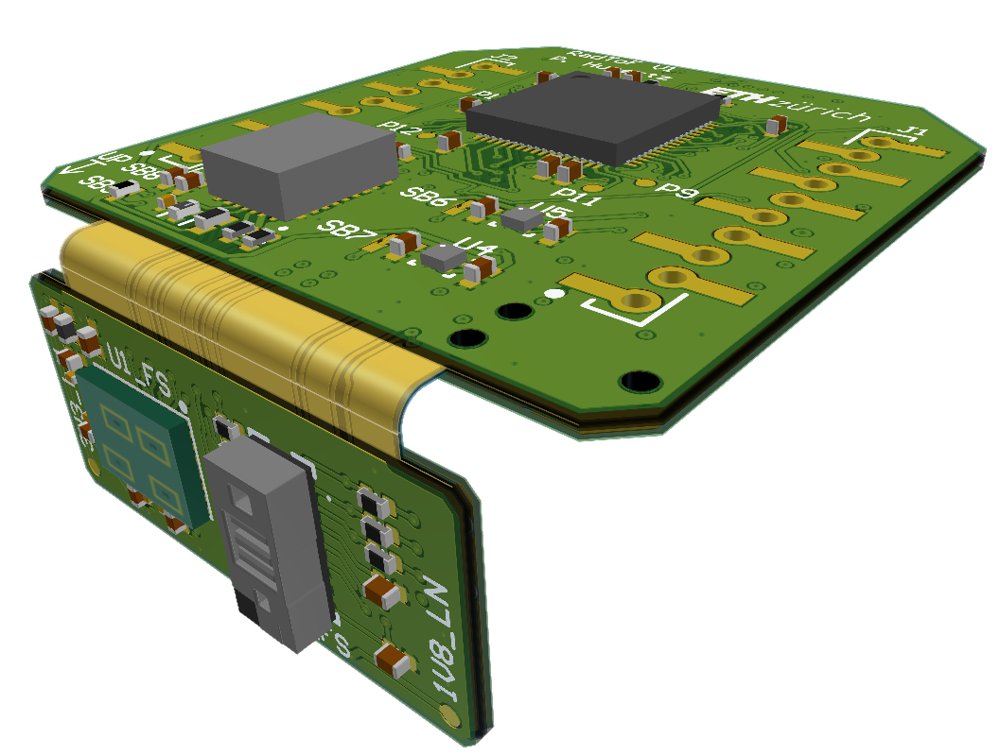
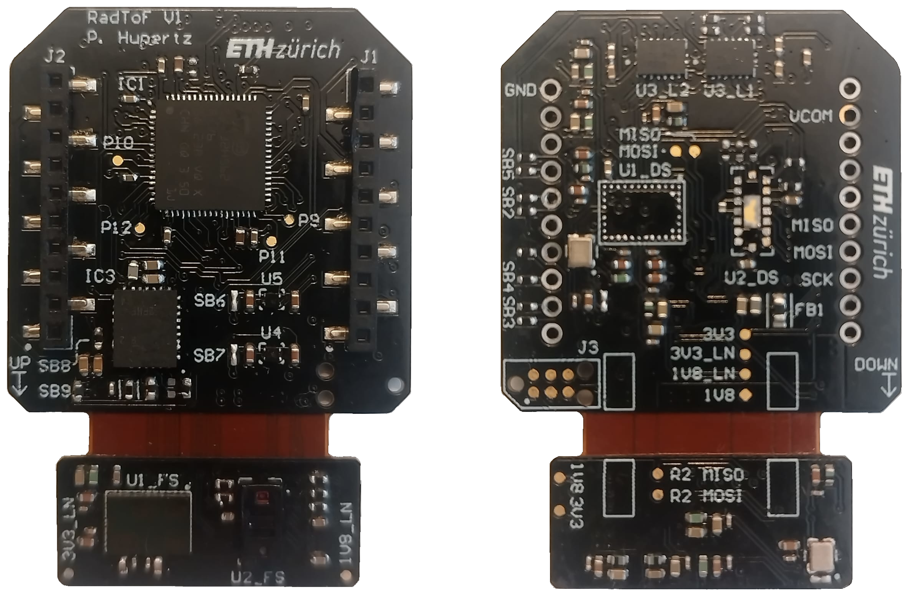

<!--
*** Template source: https://github.com/othneildrew/Best-README-Template/blob/master/README.md
-->

<!-- PROJECT SHIELDS -->
<!--
*** I'm using markdown "reference style" links for readability.
*** Reference links are enclosed in brackets [ ] instead of parentheses ( ).
*** See the bottom of this document for the declaration of the reference variables
*** for contributors-url, forks-url, etc. This is an optional, concise syntax you may use.
*** https://www.markdownguide.org/basic-syntax/#reference-style-links
-->

<!-- PROJECT LOGO -->
 

  

  <h3 align="center">"RadToF" Radar/ToF Deck</h3>

  

    60 GHz rdar extension board for the CrazyFlie 2.1
     
    <a href="https://github.com/PatrickHup/Test"><strong>Explore the docs »</strong></a>
  

<!-- TABLE OF CONTENTS -->
## Table of Contents

* [About the Project](#about-the-project)
* [Hardware](#hardware)
  * [Components](#hardware)
  * [PCB](#pcb)
* [Firmware](#firmware)
* [Acknowledgment](#acknowledgment)

<!-- ABOUT THE PROJECT -->
## About The Project

The project aims to develop an Printed Circuit Board (PCB) optimized for drones, with a key focus on implementing the 60 GHz radar by Infineon Technologies. The goal is to enable drones to navigate more effectively and efficiently. This effort is driven by the increasing importance of autonomous nano drones across various sectors, where sophisticated perception systems are crucial for safety and operational efficiency. By equipping drones with a radar system that delivers precise and reliable data, collision risks can be minimized, and operational autonomy can be improved.

## Hardware

The PCB accomodates 4 sensors, a radar and depth camera pointing forwards, and the same setup pointing downwards. This board also implements an MCU, which performs data processing before sending it to the CrazyFlie. 

### Components
The main sensor is the 60 GHz Radar by Infineon Technologies. This radar uses FMCW (Frequency Modulated Coninuous Wave) operations to measure distances. The radar comes in a compact design with built-in transmitter and 3 receivers. In addition to the radar, we utilize a 8x8 zone ranging sensor by STMicroelectronics. As mentioned before, a MCU is needed to perform data processing. We have opted for the STM32H562RIV6 for its performance and small form factor.

An important aspect of the board is its power supply. The radar requires ultra low noise 1V8 and 3V3. To achieve this, we ustilize the "Ultra low-noise low ripple" powersupply by Texas Intruments.

Main components:

* [BGT60TR13C][BGT60TR13C_url],			  60 GHz radar
* [VL53L5CX][VL53L5CX_url],     		  ToF multizone ranging sensor
* [STM32H562RIV6][STM32H562RIV6_url],		  Microcontroller
* [TPSM82912RDUR][TPSM82912RDUR_url],		  Ultra low noise switching regulator

Additional components:

* [TPS7A2018PDQNR][TPS7A2018PDQNR_url], 	  Ultra low noise LDO
* [SN74AXC4T774BQB][SN74AXC4T774BQB_url],	  Level shifter

### PCB 
The RadTof printed circuit board (PCB) was printed on a 4-Layer Flex-Rigid PCB with a total thickness of 0.84mm. Further information about the PCB can be found here:

File                                  | Content
--------------------------------------|--------
[RadToF.pdf]                          | Schematics of the deck.  
[RadToF_PDF3D.pdf]                    | Layout 3D view with details of components and nets.
[RadToF_BOM.xlsx]		      | Bill of material for the Deck PCB.
[RadToF_Draftsman.pdf]   	      | Draftsman of the PCB.
[RadToF.xls]		              | Layer stack of the Flex PCB.

Top and bottom view of the board:

	

## Firmware

The current state of the firmware is to be able to verify if the board is functional or not. The driver of the radar was provided by [tim distel] and the driver of the ToF can be found here: [ToF driver][ToF_driver_url].

The code can be opened using the STM32cubeIDE.

## Acknowledgment

Thanks goes to:

Professor: Prof. Dr. Luca Benini

Supervisors: Dr. Tomasso Polonelli and Andrea Ronco

PCB experts: Hanna Müller and Alfonso Blanco

Additional help: Tim Distel and Luka Schultess

<!-- MARKDOWN LINKS & IMAGES -->
<!-- https://www.markdownguide.org/basic-syntax/#reference-style-links -->

<!--Subsection Hardware-->
[VL53L5CX_url]:    			https://www.st.com/resource/en/datasheet/vl53l5cx.pdf
[crazyflie_url]:   			https://www.bitcraze.io/products/crazyflie-2-1/
[BGT60TR13C_url]:			https://www.infineon.com/dgdl/Infineon-DS_BGT60TR13C-DataSheet-v02_49-EN.pdf
[STM32H562RIV6_url]:			https://www.st.com/resource/en/datasheet/stm32h562ag.pdf
[TPSM82912RDUR_url]:			https://www.ti.com/lit/ds/symlink/tpsm82913e.pdf
[TPS7A2018PDQNR_url]:			https://www.ti.com/lit/ds/symlink/tps7a20.pdf
[SN74AXC4T774BQB_url]:			https://www.ti.com/lit/ds/symlink/sn74axc4t774.pdf

[ToF_driver_url]: https://www.st.com/en/embedded-software/stsw-img040.html

<!--Subsection PCB-->
[RadToF.pdf]:                          /Hardware/Project_Output/RadToF.pdf
[RadToF_PDF3D.pdf]:                    /Hardware/Project_Output/RadToF_PDF3D.pdf
[RadToF_BOM.xlsx]:                     /Hardware/Project_Output/RadToF_BOM.xlsx
[RadToF_Draftsman.pdf]:                /Hardware/Project_Output/RadToF_Draftsman.pdf
[RadToF.xls]:                          /Hardware/Project_Output/RadToF.xls

[stmcubeIDE_url]:	               https://www.st.com/en/development-tools/stm32cubeide.html
[altium_url]:	                       https://www.altium.com/
