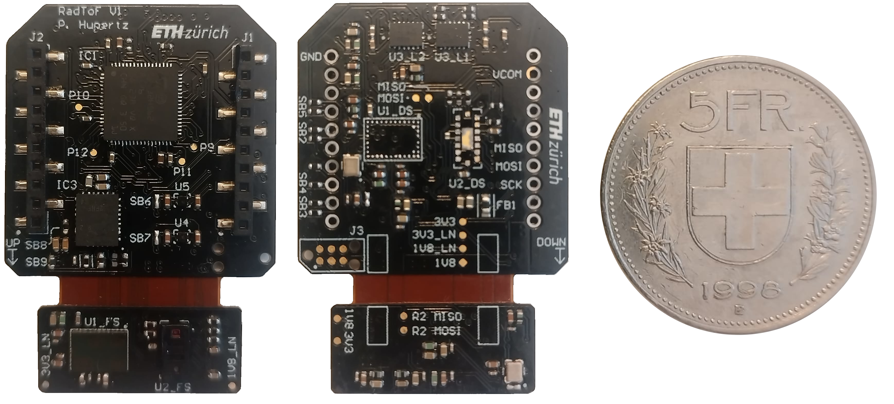

<!--
*** Template source: https://github.com/othneildrew/Best-README-Template/blob/master/README.md
-->

<!-- PROJECT SHIELDS -->
<!--
*** I'm using markdown "reference style" links for readability.
*** Reference links are enclosed in brackets [ ] instead of parentheses ( ).
*** See the bottom of this document for the declaration of the reference variables
*** for contributors-url, forks-url, etc. This is an optional, concise syntax you may use.
*** https://www.markdownguide.org/basic-syntax/#reference-style-links
-->

<!-- PROJECT LOGO -->
 

  

  <h3 align="center">"RadToF" Radar/ToF Deck</h3>

  

    60 GHz rdar extension board for the CrazyFlie 2.1
     
    <a href="https://github.com/PatrickHup/Test"><strong>Explore the docs »</strong></a>
  

<!-- TABLE OF CONTENTS -->
## Table of Contents

* [About the Project](#about-the-project)
* [Hardware](#hardware)
  * [Components](#hardware)
  * [PCB](#pcb)
* [Firmware](#firmware)
* [Related work](#related-work)
* [Acknowledgment](#acknowledgment)

<!-- ABOUT THE PROJECT -->
## About The Project

The RadToF project aims to develop a Printed Circuit Board (PCB) optimized for drones, with a key focus on implementing the 60 GHz radar by Infineon Technologies. The goal is to enable drones to navigate more effectively and efficiently, driven by the increasing importance of autonomous nano drones across various sectors where sophisticated perception systems are crucial for safety and operational efficiency. By equipping drones with a radar system that delivers precise and reliable data, collision risks can be minimized, and operational autonomy can be improved.

**WARNING: USE AT YOUR OWN RISK, THERE MAY BE BUGS IN BOTH SOFTWARE AND HARDWARE**

## Hardware

The PCB accommodates four sensors: a radar and a depth camera pointing forwards, and the same setup pointing downwards. This board also includes an MCU that processes data before sending it to the CrazyFlie.

### Components
The main sensor is the 60 GHz radar by Infineon Technologies, using FMCW (Frequency Modulated Continuous Wave) operations to measure distances. The radar features a compact design with a built-in transmitter and three receivers. Additionally, we utilize an 8x8 zone ranging sensor by STMicroelectronics. The MCU chosen for this project is the STM32H562RIV6, selected for its performance and small form factor.

An important aspect of the board is its power supply. The radar requires ultra-low noise 1V8 and 3V3, achieved using the "Ultra low-noise low ripple" power supply by Texas Instruments.

Main components:

* [BGT60TR13C][BGT60TR13C_url],			  60 GHz radar
* [VL53L8CX][VL53L8CX_url],     		  ToF multizone ranging sensor
* [STM32H562RIV6][STM32H562RIV6_url],		  Microcontroller
* [TPSM82912RDUR][TPSM82912RDUR_url],		  Ultra low noise switching regulator

Additional components:

* [TPS7A2018PDQNR][TPS7A2018PDQNR_url], 	  Ultra low noise LDO
* [SN74AXC4T774BQB][SN74AXC4T774BQB_url],	  Level shifter

### PCB 
The RadToF printed circuit board (PCB) is fabricated on a 4-layer Flex-Rigid PCB with a rigid PCB thickness of 0.84mm and a flex thickness of 0.16mm. Further information about the PCB can be found here:

File                                  | Content
--------------------------------------|--------
[RadToF.pdf]                          | Schematics of the deck.  
[RadToF_PDF3D.pdf]                    | Layout 3D view with details of components and nets.
[RadToF_BOM.xlsx]		      | Bill of material for the Deck PCB.
[RadToF_Draftsman.pdf]   	      | Draftsman of the PCB.
[RadToF.xls]		              | Layer stack of the Flex PCB.

The Altium project file [RadToF.prjpch] can be opened and edited using ALtium designer version 24.3.1

Top and bottom view of the board:

	

#### Solder instruction:

#### Top side:

1. Pre-heat the PCB over 2-3 hours from room temperature to 250 °C to allow water molecules in flex pcb to evaporate. This prevents delamination.
2. Apply 217 °C solder paste on side marked "Top" with the help of a stencil if availible. NOTE: do not apply solder paste on sensor pads.
3. Place components. Except the sensors (radar and ToF).
5. Place assembled board, "Top" side up, on pre preheated (250 °C) hot plate.
6. Wait for solder paste to melt and remove to cool.
7. Verify functionality of power supply by checking voltages on debug pads.

#### Bottom side:

1. Apply 217 °C solder paste on side marked "Bottom" with the help of a sencil if availible. NOTE: do not apply solder paste on sensor pads.
2. Place components. Except the sensors (radar and ToF).
3. Place assembled board, "Bottom" side up, on pre preheated (150 °C) hot plate.
4. Use hot air gun, set to 395 °C, to carefully melt solder paste.
5. Verify functionality of MCU by trying to program it.

#### Radar soldering:

1. Do not apply solder paste
2. Place on 150 °C pre heated hot plate
3. Heat with heat gun set to 395 °C till soldered

NOTE: if radar soldered unevenly, remove solder paste and on pads and on radar then re-ball radar with stencil

#### ToF sensor:

WARNING: high temperature might damage plastic housing

1. Apply 138 °C solder paste on pads
2. Place on pre heated hot plate at 150 °C
3. Carefully apply heat with hot air gun

## Firmware

Needed software:

* [STM32cubeIDE][stm32cubeide_url], 		STM32cubeIDE version 1.15.1

The current state of the firmware is to be able to verify if the board is functional or not. The driver of the radar was provided by Tim Distel and the driver of the ToF can be found here: [ToF driver][ToF_driver_url].

### Getting started:

#### material:

1. CrazyFlie 2.1
2. RadToF expansion deck
3. laptop
4. ST-LINK

#### How to program extension board:

1. Download STM32cubeIDE and the 'Firmware' folder
2. open '.project' file with STM32cubeIDE (version 1.15.1)
3. Connect extension board with computer with ST-LINK
4. Compilie and upload firmware

## Related work

[ToF deck][ToF_deck_url] offers a different approach for the extension board, featuring a ToF sensor facing forwards and backwards.

## Acknowledgment

Thanks goes to:

Professor: Prof. Dr. Luca Benini

Supervisors: Dr. Tomasso Polonelli and Andrea Ronco

PCB experts: Hanna Müller and Alfonso Blanco

Additional help: Tim Distel and Luka Schultess

<!-- MARKDOWN LINKS & IMAGES -->
<!-- https://www.markdownguide.org/basic-syntax/#reference-style-links -->

<!--Subsection Hardware-->
[VL53L8CX_url]:    			https://www.st.com/resource/en/datasheet/vl53l8cx.pdf
[crazyflie_url]:   			https://www.bitcraze.io/products/crazyflie-2-1/
[BGT60TR13C_url]:			https://www.infineon.com/dgdl/Infineon-DS_BGT60TR13C-DataSheet-v02_49-EN.pdf?fileId=8ac78c8c7d718a49017d94bac88e5d43
[STM32H562RIV6_url]:			https://www.st.com/resource/en/datasheet/stm32h562ag.pdf
[TPSM82912RDUR_url]:			https://www.ti.com/lit/ds/symlink/tpsm82913e.pdf
[TPS7A2018PDQNR_url]:			https://www.ti.com/lit/ds/symlink/tps7a20.pdf
[SN74AXC4T774BQB_url]:			https://www.ti.com/lit/ds/symlink/sn74axc4t774.pdf
[stm32cubeide_url]: 			https://www.st.com/en/development-tools/stm32cubeide.html

[ToF_driver_url]: 			https://www.st.com/en/embedded-software/stsw-img040.html
[ToF_deck_url]: 			https://github.com/ETH-PBL/Matrix_ToF_Drones/tree/main
<!--Subsection PCB-->
[RadToF.pdf]:                          /Hardware/Project_Output/RadToF.pdf
[RadToF_PDF3D.pdf]:                    /Hardware/Project_Output/RadToF_PDF3D.pdf
[RadToF_BOM.xlsx]:                     /Hardware/Project_Output/RadToF_BOM.xlsx
[RadToF_Draftsman.pdf]:                /Hardware/Project_Output/RadToF_Draftsman.pdf
[RadToF.xls]:                          /Hardware/Project_Output/RadToF.xls
[RadToF.prjpch]:                       /Hardware/RadToF.prjpcb

[stmcubeIDE_url]:	               https://www.st.com/en/development-tools/stm32cubeide.html
[altium_url]:	                       https://www.altium.com/
